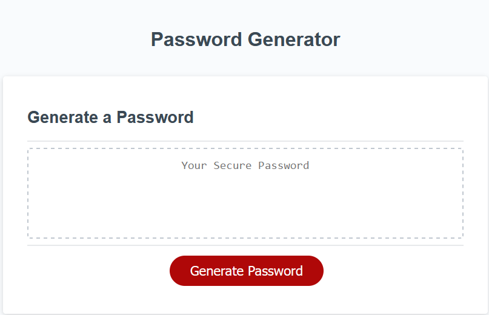
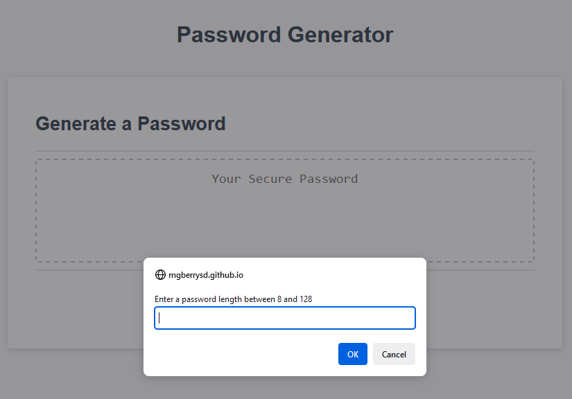

# <password-generator>

## Description

This project aimed to create a secure password generator using JavaScript. The project prompted the user to provide specific characteristics of the password, including length and types of characters. The page would then display the password to the user. 

This project highlighted the use of JavaScript to interect with the user via page elements and change the displayed html. The project used conditional logic, for loops, and array and string operators to create the passwords.

Note: Password were generated using Math.random and are thus should not be used for actual passwords.

## Usage

A deployed version of the project can be found at https://mgberrysd.github.io/password-generator/

When loaded the page should appear as:

When the generate password button is pressed the page should display the password prompt:

## Credits

The JS for the password generator was created by Michael Berry.